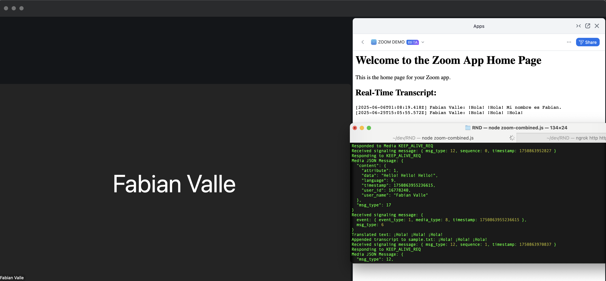

# zoom-rtms-demo



---

# Zoom Real-Time Media Streams (RTMS) and AI Translation Example

This repository contains a Node.js application demonstrating how to leverage Zoom's Real-Time Media Streams (RTMS) to capture live meeting transcripts and translate them in real-time using an AI translation module.

-----

## Features

  * **Zoom OAuth Integration:** Securely authenticates with Zoom for API access.
  * **Webhook Listener:** Responds to Zoom webhook events, including `meeting.rtms_started` and `meeting.rtms_stopped`.
  * **Real-Time Transcript Capture:** Connects to Zoom's Media WebSocket to receive live meeting transcripts.
  * **AI-Powered Translation:** Integrates with a translation library to translate incoming English transcripts to Spanish.
  * **Local Transcript Storage:** Appends translated transcripts to a `sample.txt` file.
  * **Web Interface:** A simple `/home` route displays the real-time translated transcript from `sample.txt`.

-----

## Getting Started

### Prerequisites

  * Node.js (v14 or higher recommended)
  * An ngrok account (or similar tunneling service) for exposing your local development server to the internet.
  * A Zoom Developer Account and a Zoom App configured with:
      * **OAuth:** Enabled with a Redirect URL pointing to your ngrok URL + `/callback` (e.g., `https://your-ngrok-url.ngrok-free.app/callback`).
      * **Scopes:** `user:read`, `meeting:read`, `meeting:write`.
      * **Webhook Subscription:** Subscribe to `meeting.rtms_started` and `meeting.rtms_stopped` events. The Webhook URL should point to your ngrok URL + `/webhook` (e.g., `https://your-ngrok-url.ngrok-free.app/webhook`).
      * **Real-Time Media Streams:** Enabled for your app.

### Installation

1.  **Clone the repository:**

    ```bash
    git clone git@github.com:ranfysvalle02/zoom-rtms-demo.git
    cd zoom-rtms-demo
    ```

2.  **Install dependencies:**

    ```bash
    npm install
    ```

3.  **Configure environment variables:**
    Rename `.env.example` to `.env` and update the following:

    ```
    CLIENT_ID=  
    CLIENT_SECRET=  
    REDIRECT_URI=https://....ngrok-free.app/callback  
    ZOOM_SECRET_TOKEN=
    ```

      * `CLIENT_ID` and `CLIENT_SECRET`: Obtain these from your Zoom App credentials.
      * `REDIRECT_URI`: This should be your ngrok HTTPS URL followed by `/callback`. **Ensure this matches the Redirect URL configured in your Zoom App.**
      * `ZOOM_SECRET_TOKEN`: This is the "Webhook Secret Token" found in your Zoom App's Webhook Subscription settings.

### Running the Application

1.  **Start ngrok (or your tunneling service):**

    ```bash
    ngrok http 3000
    ```

    Make sure to use the HTTPS URL provided by ngrok for your `REDIRECT_URI` and webhook URL in the Zoom App configuration.

2.  **Start the Node.js application:**

    ```bash
    npm start
    ```

3.  **Authorize your Zoom App:**
    Open your browser and navigate to `http://localhost:3000/auth`. This will redirect you to Zoom's authorization page. Grant access to your app. After successful authorization, you will be redirected to `http://localhost:3000/callback` showing your user information.

4.  **Access the Home Page:**
    Navigate to `http://localhost:3000/home` to view the live translated transcripts. Initially, it will show "Loading..." until RTMS data is received.

### Testing Real-Time Transcripts

1.  **Start a Zoom Meeting:** Ensure you are logged into Zoom with the same account that authorized the application.
2.  **Enable Live Transcription:** In your Zoom meeting, ensure live transcription is enabled.
3.  **Speak in the Meeting:** As you speak in the meeting, the application will receive the transcript data, translate it, and update the `sample.txt` file, which will then be displayed on the `/home` page.

### Expected Output

```
Media JSON Message: {
  "content": {
    "attribute": 1,
    "data": "Hello! Hello!",
    "language": 9,
    "timestamp": 1750791055005605,
    "user_id": 16778240,
    "user_name": "Fabian Valle"
  },
  "msg_type": 17
}
Received signaling message: {
  event: { event_type: 1, media_type: 8, timestamp: 1750791055005605 },
  msg_type: 6
}
Translated text: ¡Hola! ¡Hola!
Appended transcript to sample.txt: ¡Hola! ¡Hola!

```

-----

## Important Notes

  * **Security:** This is a sample application. For production environments, consider more robust security measures, including secure storage of tokens, advanced error handling, and comprehensive logging.
  * **`sample.txt`:** The `sample.txt` file is used for demonstration purposes. In a production scenario, you would typically store transcripts in a database or stream them to another service.
  * **`translate` Module:** This example uses the `translate` npm package. Ensure you have the necessary API keys or configurations if you are using a cloud-based translation service.
  * **Webhook Validation:** The `/webhook` endpoint includes basic validation for Zoom's URL validation challenge.

-----

## Full Code

```
require('dotenv').config();  
  
const express = require('express');    
const axios = require('axios');    
const querystring = require('querystring');    
const fs = require('fs');    
const crypto = require('crypto');    
const WebSocket = require('ws');    
const translateModule = require('translate'); // Adjusted import    
const translate = translateModule.default || translateModule; // Access the default export    
translate.from = 'en';    
    
const app = express();    
app.use(express.json()); // For parsing JSON in request bodies    
    
// **Add Security Headers Middleware**    
app.use((req, res, next) => {    
  // Enforce HTTPS connections    
  res.setHeader('Strict-Transport-Security', 'max-age=31536000; includeSubDomains');    
    
  // Prevent MIME type sniffing    
  res.setHeader('X-Content-Type-Options', 'nosniff');    
    
  // Define Content Security Policy    
  res.setHeader('Content-Security-Policy', "default-src 'self'");    
    
  // Control referrer information    
  res.setHeader('Referrer-Policy', 'no-referrer');    
    
  next();    
});    
    
// Replace these with your actual Client ID and Client Secret    
const CLIENT_ID = process.env.CLIENT_ID;    
const CLIENT_SECRET = process.env.CLIENT_SECRET;    
    
// **Important:** Update this REDIRECT_URI with your actual ngrok HTTPS URL appended with /callback    
const REDIRECT_URI = process.env.REDIRECT_URI;    
    
// Zoom's OAuth endpoints    
const AUTHORIZATION_URL = 'https://zoom.us/oauth/authorize';    
const TOKEN_URL = 'https://zoom.us/oauth/token';    
const USER_INFO_URL = 'https://api.zoom.us/v2/users/me';    
    
// Zoom credentials for Webhook validation    
const ZOOM_SECRET_TOKEN = process.env.ZOOM_SECRET_TOKEN;    
    
// Store the access token globally    
let accessToken = ''; // Initialize accessToken    
    
// Map to store active RTMS connections    
const activeConnections = new Map();    
    
/**    
 * Home route    
 */    
app.get('/home', (req, res) => {    
  console.log('Accessing home page');    
    
  // Generate nonce    
  const nonce = crypto.randomBytes(16).toString('base64');    
    
  // Set CSP with nonce    
  res.setHeader('Content-Security-Policy', `default-src 'self'; script-src 'self' 'nonce-${nonce}'`);    
    
  res.send(`    
    <html>    
      <head>    
        <title>Zoom App Home</title>    
        <style>    
          #sample-text {    
            white-space: pre-wrap;    
          }    
        </style>    
      </head>    
      <body>    
        <h1>Welcome to the Zoom App Home Page</h1>    
        <p>This is the home page for your Zoom app.</p>    
        <h2>Real-Time Transcript:</h2>    
        <pre id="sample-text">Loading...</pre>    
        <script nonce="${nonce}">    
          function updateSampleText() {    
            fetch('/sample-text')    
              .then(response => response.text())    
              .then(data => {    
                document.getElementById('sample-text').innerText = data;    
              })    
              .catch(error => {    
                console.error('Error fetching sample text:', error);    
              });    
          }    
    
          // Initial load    
          updateSampleText();    
    
          // Poll every 5 seconds    
          setInterval(updateSampleText, 5000);    
        </script>    
      </body>    
    </html>    
  `);    
});    
    
/**    
 * Route to serve the sample text    
 */    
app.get('/sample-text', (req, res) => {    
  fs.readFile('sample.txt', 'utf8', (err, data) => {    
    if (err) {    
      console.error('Error reading sample.txt:', err);    
      res.status(500).send('Error reading sample.txt');    
      return;    
    }    
    res.send(data);    
  });    
});    
    
// Redirect root to /home for convenience    
app.get('/', (req, res) => {    
  res.redirect('/home');    
});    
    
/**    
 * Route to start the OAuth flow    
 */    
app.get('/auth', (req, res) => {    
  console.log('Starting OAuth flow');    
  const authUrl = `${AUTHORIZATION_URL}?response_type=code&client_id=${CLIENT_ID}&redirect_uri=${encodeURIComponent(REDIRECT_URI)}`;    
  res.redirect(authUrl);    
});    
    
/**    
 * Callback route to handle the OAuth redirect and fetch user info    
 */    
app.get('/callback', async (req, res) => {    
  const { code } = req.query;    
    
  if (!code) {    
    console.error('No authorization code provided');    
    return res.status(400).send('No authorization code provided');    
  }    
    
  console.log('Authorization code received:', code);    
    
  try {    
    // Exchange authorization code for access token    
    const tokenResponse = await axios.post(    
      TOKEN_URL,    
      querystring.stringify({    
        grant_type: 'authorization_code',    
        code: code,    
        redirect_uri: REDIRECT_URI    
      }),    
      {    
        headers: {    
          'Content-Type': 'application/x-www-form-urlencoded',    
          'Authorization': `Basic ${Buffer.from(`${CLIENT_ID}:${CLIENT_SECRET}`).toString('base64')}`    
        }    
      }    
    );    
    
    const { access_token, refresh_token, expires_in, token_type } = tokenResponse.data;    
    console.log('Access token received:', access_token);    
    
    // Store the access token in the global variable    
    accessToken = access_token;    
    
    // Use the access token to fetch user information    
    const userInfoResponse = await axios.get(USER_INFO_URL, {    
      headers: {    
        'Authorization': `Bearer ${access_token}`    
      }    
    });    
    
    const userInfo = userInfoResponse.data;    
    console.log('User info received:', userInfo);    
    
    // Render user information    
    res.send(`    
      <html>    
        <head>    
          <title>User Information</title>    
        </head>    
        <body>    
          <h1>User Information</h1>    
          <p><strong>Display Name:</strong> ${userInfo.display_name}</p>    
          <p><strong>Email:</strong> ${userInfo.email}</p>    
          <p><strong>Username:</strong> ${userInfo.username || 'N/A'}</p>    
          <p><strong>User ID:</strong> ${userInfo.id}</p>    
          <p><strong>Type:</strong> ${userInfo.type === 1 ? 'Basic User' : userInfo.type === 2 ? 'Licensed User' : 'Other'}</p>    
          <p><strong>First Name:</strong> ${userInfo.first_name}</p>    
          <p><strong>Last Name:</strong> ${userInfo.last_name}</p>    
          <p><strong>Created At:</strong> ${userInfo.created_at}</p>    
        </body>    
      </html>    
    `);    
  } catch (error) {    
    console.error('Error during OAuth process:', error.response ? error.response.data : error.message);    
    res.status(500).send('Error during OAuth process');    
  }    
});    
    
/**    
 * Webhook route to handle Zoom events    
 */    
app.post('/webhook', (req, res) => {    
  const { event, payload } = req.body;    
  console.log('Webhook received:', event);    
  console.log('Payload:', JSON.stringify(payload, null, 2));    
    
  if (event === 'endpoint.url_validation' && payload?.plainToken) {    
    const hash = crypto.createHmac('sha256', ZOOM_SECRET_TOKEN)    
      .update(payload.plainToken)    
      .digest('hex');    
    return res.json({    
      plainToken: payload.plainToken,    
      encryptedToken: hash,    
    });    
  }    
    
  if (event === 'meeting.rtms_started') {    
    const { meeting_uuid, rtms_stream_id, server_urls } = payload;    
    console.log(`Starting RTMS for meeting ${meeting_uuid}`);    
    connectToSignalingWebSocket(meeting_uuid, rtms_stream_id, server_urls);    
  }    
    
  if (event === 'meeting.rtms_stopped') {    
    const { meeting_uuid } = payload;    
    console.log(`Stopping RTMS for meeting ${meeting_uuid}`);    
    if (activeConnections.has(meeting_uuid)) {    
      const connections = activeConnections.get(meeting_uuid);    
      for (const [type, connObj] of Object.entries(connections)) {    
        const ws = connObj?.socket;    
        if (ws && typeof ws.close === 'function') {    
          if (ws.readyState === WebSocket.CONNECTING) {    
            console.warn(`[${type}] socket is connecting, will close after open.`);    
            ws.once('open', () => ws.close());    
          } else {    
            ws.close();    
          }    
        }    
      }    
      activeConnections.delete(meeting_uuid);    
    }    
  }    
    
  if (event === 'meeting.participant_joined') {    
    const { object } = payload;    
    const { id: meeting_id, participant } = object;    
    console.log(`Participant ${participant.participant_user_id} joined meeting ${meeting_id}`);    
    //RTMS is auto-started from the Zoom App settings by an admin  
    // or you can uncomment the line below to start RTMS manually by participant_id  
    //startRTMS(meeting_id, participant.participant_user_id);    
  }    
    
  res.sendStatus(200);    
});    
    
/**    
 * Generate signature for RTMS WebSocket authentication    
 */    
function generateSignature(meetingUuid, streamId) {    
  const message = `${CLIENT_ID},${meetingUuid},${streamId}`;    
  console.log('Generating signature for message:', message);    
  return crypto.createHmac('sha256', CLIENT_SECRET).update(message).digest('hex');    
}    
    
/**    
 * Connect to the signaling WebSocket    
 */    
function connectToSignalingWebSocket(meetingUuid, streamId, serverUrls) {    
  console.log(`Connecting to signaling WebSocket for meeting ${meetingUuid}`);    
  const signalingWs = new WebSocket(serverUrls);    
    
  if (!activeConnections.has(meetingUuid)) {    
    activeConnections.set(meetingUuid, {    
      signaling: { socket: null, state: 'connecting', lastKeepAlive: null, url: serverUrls },    
      media: { socket: null, state: 'idle', lastKeepAlive: null }    
    });    
  }    
    
  const conn = activeConnections.get(meetingUuid);    
  conn.signaling.socket = signalingWs;    
    
  signalingWs.on('open', () => {    
    if (!activeConnections.has(meetingUuid)) {    
      console.warn(`Signaling WebSocket opened but RTMS was stopped for ${meetingUuid}, aborting.`);    
      signalingWs.close();    
      return;    
    }    
    
    console.log(`Signaling WebSocket opened for meeting ${meetingUuid}`);    
    const signature = generateSignature(meetingUuid, streamId);    
    const handshakeMsg = {    
      msg_type: 1,    
      meeting_uuid: meetingUuid,    
      rtms_stream_id: streamId,    
      signature    
    };    
    console.log('Sending signaling handshake:', handshakeMsg);    
    signalingWs.send(JSON.stringify(handshakeMsg));    
    conn.signaling.state = 'authenticated';    
  });    
    
  signalingWs.on('message', (data) => {    
    const msg = JSON.parse(data);    
    console.log('Received signaling message:', msg);    
    if (msg.msg_type === 2 && msg.status_code === 0) {    
      const mediaUrl = msg.media_server.server_urls.all;    
      console.log('Signaling handshake successful. Media server URL:', mediaUrl);    
      connectToMediaWebSocket(mediaUrl, meetingUuid, streamId, signalingWs);    
      conn.signaling.state = 'ready';    
    }    
    if (msg.msg_type === 12) {    
      conn.signaling.lastKeepAlive = Date.now();    
      console.log('Responding to KEEP_ALIVE_REQ');    
      signalingWs.send(JSON.stringify({    
        msg_type: 13,    
        timestamp: msg.timestamp    
      }));    
    }    
  });    
    
  signalingWs.on('close', () => {    
    console.log(`Signaling WebSocket closed for meeting ${meetingUuid}`);    
    const conn = activeConnections.get(meetingUuid);    
    if (conn) conn.signaling.state = 'closed';    
  });    
    
  signalingWs.on('error', (err) => {    
    const conn = activeConnections.get(meetingUuid);    
    if (conn) conn.signaling.state = 'error';    
    console.error('Signaling error:', err);    
  });    
}    
    
/**    
 * Connect to the media WebSocket    
 */    
function connectToMediaWebSocket(mediaUrl, meetingUuid, streamId, signalingSocket) {    
  console.log(`Connecting to media WebSocket at ${mediaUrl} for meeting ${meetingUuid}`);    
  const mediaWs = new WebSocket(mediaUrl);    
  const conn = activeConnections.get(meetingUuid);    
  conn.media.socket = mediaWs;    
  conn.media.state = 'connecting';    
    
  mediaWs.on('open', () => {    
    if (!activeConnections.has(meetingUuid)) {    
      console.warn(`Media WebSocket opened but RTMS was stopped for ${meetingUuid}, aborting handshake.`);    
      mediaWs.close();    
      return;    
    }    
    const signature = generateSignature(meetingUuid, streamId);    
    const handshakeMsg = {    
      msg_type: 3, // DATA_HAND_SHAKE_REQ    
      protocol_version: 1,    
      meeting_uuid: meetingUuid,    
      rtms_stream_id: streamId,    
      signature,    
      media_type: 8, // MEDIA_DATA_TRANSCRIPT    
      payload_encryption: false,    
    };    
    console.log('Sending media handshake:', handshakeMsg);    
    mediaWs.send(JSON.stringify(handshakeMsg));    
    conn.media.state = 'authenticated';    
  });    
    
  mediaWs.on('message', async (data) => {    
    try {    
      // Try to parse as JSON first    
      const msg = JSON.parse(data.toString());    
      console.log('Media JSON Message:', JSON.stringify(msg, null, 2));    
    
      // Handle incoming transcript data    
      if (msg.msg_type === 17 && msg.content && msg.content.data) {    
        let transcript = msg.content.data;    
    
        // Translate the transcript to Spanish    
        try {    
          let translated = await translate(transcript, { to: 'es' });    
          console.log('Translated text:', translated);    
          // Optionally include timestamp and username    
          const timestamp = new Date().toISOString();    
          const userName = msg.content.user_name || 'Unknown';    
          const transcriptEntry = `[${timestamp}] ${userName}: ${translated}\n`;    
    
          // Append the transcript to sample.txt    
          fs.appendFile('sample.txt', transcriptEntry, (err) => {    
            if (err) {    
              console.error('Error writing to sample.txt:', err);    
            } else {    
              console.log('Appended transcript to sample.txt:', translated);    
            }    
          });    
        } catch (error) {    
          console.error('Translation error:', error);    
        }    
      }    
    
      // Handle successful media handshake    
      if (msg.msg_type === 4 && msg.status_code === 0) { // DATA_HAND_SHAKE_RESP    
        signalingSocket.send(    
          JSON.stringify({    
            msg_type: 7, // CLIENT_READY_ACK    
            rtms_stream_id: streamId,    
          })    
        );    
        console.log('Media handshake successful, sent start streaming request');    
      }    
    
      // Respond to keep-alive requests    
      if (msg.msg_type === 12) { // KEEP_ALIVE_REQ    
        mediaWs.send(    
          JSON.stringify({    
            msg_type: 13, // KEEP_ALIVE_RESP    
            timestamp: msg.timestamp,    
          })    
        );    
        console.log('Responded to Media KEEP_ALIVE_REQ');    
      }    
    } catch (err) {    
      console.log('Raw message:', data.toString());    
      console.log('Error parsing message:', err);    
    }    
  });    
    
  mediaWs.on('error', (err) => {    
    console.error('Media socket error:', err);    
    conn.media.state = 'error';    
  });    
    
  mediaWs.on('close', () => {    
    console.log('Media socket closed for meeting', meetingUuid);    
    if (!activeConnections.has(meetingUuid)) {    
      console.warn(`RTMS already stopped for meeting ${meetingUuid}, skipping reconnection.`);    
      return;    
    }    
    
    const conn = activeConnections.get(meetingUuid);    
    if (conn.signaling.state === 'ready' && conn.signaling.socket?.readyState === WebSocket.OPEN) {    
      console.log('Reconnecting media socket...');    
      connectToMediaWebSocket(mediaUrl, meetingUuid, streamId, conn.signaling.socket);    
    } else if (conn.signaling.url) {    
      console.warn('Signaling socket not usable. Reconnecting both signaling and media...');    
      connectToSignalingWebSocket(meetingUuid, streamId, conn.signaling.url);    
    } else {    
      console.warn('Cannot reconnect media: no signaling URL found.');    
      conn.media.state = 'closed';    
    }    
  });    
}    
    
/**    
 * Start RTMS for a participant    
 */    
async function startRTMS(meetingId, participantUserId) {    
  if (!accessToken) {    
    console.error('Access token is not available. Cannot start RTMS.');    
    return;    
  }    
    
  try {    
    const response = await axios.patch(`https://api.zoom.us/v2/live_meetings/${meetingId}/rtms_app/status`, {    
      action: "start",    
      settings: {    
        participant_user_id: participantUserId,    
        client_id: CLIENT_ID    
      }    
    }, {    
      headers: {    
        'Content-Type': 'application/json',    
        'Authorization': `Bearer ${accessToken}`    
      }    
    });    
    console.log('RTMS start response:', response.data);    
  } catch (error) {    
    console.error('Error starting RTMS:', error.response?.data || error.message);    
  }    
}    
    
// Start the server    
const PORT = 3000;    
app.listen(PORT, () => {    
  console.log(`Server is running on http://localhost:${PORT}`);    
});    
```

---

-----  
   
## Appendix: Integrating MongoDB Storage  
   
### Introduction  
   
Adding MongoDB to your application enhances its data storage capabilities, especially for handling real-time transcripts and translations. MongoDB's **document-oriented model** aligns perfectly with the structure of transcript data, allowing for flexible, scalable, and efficient storage.  
   
### Why MongoDB is a Great Fit  
   
- **Document Model Flexibility:** MongoDB stores data in JSON-like documents, making it easy to model complex data structures, such as transcripts with nested user information, timestamps, and translations.  
    
- **Scalable and High Performance:** Designed for scalability and high throughput, MongoDB can handle large volumes of data generated during live meetings without compromising on performance.  
   
- **Rich Query Language and Aggregations:** MongoDB's powerful query capabilities and aggregation framework enable complex data retrieval and real-time analytics, such as filtering transcripts by user, time ranges, or languages.  
   
- **Indexing and Full-Text Search:** Efficient indexing mechanisms and full-text search support allow for quick retrieval and searching of transcripts.  
   
- **Ease of Integration:** The MongoDB Node.js driver integrates seamlessly with Express.js applications, making it straightforward to incorporate into your existing codebase.  
   
### Setting Up MongoDB  
   
#### Prerequisites  
   
- **MongoDB Instance:** You can use a local MongoDB installation, a Docker container, or a cloud-based service like MongoDB Atlas.  
   
- **MongoDB Node.js Driver:** Ensure the `mongodb` npm package is installed.  
  
  ```bash  
  npm install mongodb  
  ```  
   
#### Configuration  
   
1. **Create a `models` Directory:**  
  
   Organize your database schemas and models separately.  
  
   ```bash  
   mkdir models  
   ```  
   
2. **Database Connection (`db.js`):**  
  
   In the `models` directory, create a file called `db.js` to handle the connection logic.  
  
   ```javascript  
   // models/db.js  
  
   const { MongoClient } = require('mongodb');  
  
   const uri = process.env.MONGODB_URI || 'mongodb://localhost:27017';  
   const client = new MongoClient(uri);  
  
   let db;  
  
   async function connectDB() {  
     if (db) return db;  
     try {  
       await client.connect();  
       db = client.db('zoom_rtms');  
       console.log('Connected to MongoDB');  
       return db;  
     } catch (error) {  
       console.error('MongoDB connection error:', error);  
     }  
   }  
  
   module.exports = { connectDB };  
   ```  
   
3. **Transcript Model (`Transcript.js`):**  
  
   Define a model for storing transcripts.  
  
   ```javascript  
   // models/Transcript.js  
  
   const { ObjectId } = require('mongodb');  
  
   class Transcript {  
     constructor(db) {  
       this.collection = db.collection('transcripts');  
     }  
  
     async insert(transcriptData) {  
       const result = await this.collection.insertOne(transcriptData);  
       return result.insertedId;  
     }  
  
     async findAll(filters = {}) {  
       return await this.collection.find(filters).toArray();  
     }  
  
     // Additional methods for aggregations, updates, etc.  
   }  
  
   module.exports = Transcript;  
   ```  
   
4. **Update the Main Application Code:**  
  
   Modify your main application file to use MongoDB for storing transcripts.  
  
   ```javascript  
   // Add at the top of your main application file  
  
   const { connectDB } = require('./models/db');  
   const Transcript = require('./models/Transcript');  
  
   let transcriptModel;  
  
   (async () => {  
     const db = await connectDB();  
     transcriptModel = new Transcript(db);  
   })();  
   ```  
   
### Modifying the Transcript Handling Logic  
   
Instead of appending transcripts to `sample.txt`, you will store them in MongoDB.  
   
#### Updated `connectToMediaWebSocket` Function:  
   
```javascript  
// Inside the mediaWs.on('message') handler  
   
mediaWs.on('message', async (data) => {  
  try {  
    const msg = JSON.parse(data.toString());  
  
    // Handle incoming transcript data  
    if (msg.msg_type === 17 && msg.content && msg.content.data) {  
      let transcript = msg.content.data;  
  
      // Translate the transcript to Spanish  
      try {  
        let translated = await translate(transcript, { to: 'es' });  
        console.log('Translated text:', translated);  
  
        // Create a transcript document  
        const transcriptDocument = {  
          meeting_uuid: meetingUuid,  
          timestamp: new Date(msg.content.timestamp / 1000), // Convert timestamp to Date  
          user_id: msg.content.user_id,  
          user_name: msg.content.user_name || 'Unknown',  
          original_text: transcript,  
          translated_text: translated,  
          language: msg.content.language,  
        };  
  
        // Save the transcript to MongoDB  
        const insertedId = await transcriptModel.insert(transcriptDocument);  
        console.log('Inserted transcript with ID:', insertedId);  
      } catch (error) {  
        console.error('Translation or MongoDB error:', error);  
      }  
    }  
  
    // ... rest of your code  
  } catch (err) {  
    console.log('Error parsing message:', err);  
  }  
});  
```  
   
#### Updating the `/home` Route:  
   
Modify your `/home` route to fetch transcripts from MongoDB instead of reading from `sample.txt`.  
   
```javascript  
app.get('/home', async (req, res) => {  
  console.log('Accessing home page');  
  
  // Generate nonce  
  const nonce = crypto.randomBytes(16).toString('base64');  
  
  // Set CSP with nonce  
  res.setHeader('Content-Security-Policy', `default-src 'self'; script-src 'self' 'nonce-${nonce}'`);  
  
  // Fetch initial transcripts  
  const transcripts = await transcriptModel.findAll();  
  
  res.send(`  
    <html>  
      <head>  
        <title>Zoom App Home</title>  
        <style>  
          #transcript-text {  
            white-space: pre-wrap;  
          }  
        </style>  
      </head>  
      <body>  
        <h1>Welcome to the Zoom App Home Page</h1>  
        <p>This is the home page for your Zoom app.</p>  
        <h2>Real-Time Transcript:</h2>  
        <div id="transcript-text">Loading...</div>  
        <script nonce="${nonce}">  
          async function updateTranscriptText() {  
            try {  
              const response = await fetch('/transcripts');  
              const data = await response.json();  
              const transcriptDiv = document.getElementById('transcript-text');  
              transcriptDiv.innerHTML = '';  
              data.forEach(item => {  
                const p = document.createElement('p');  
                p.textContent = \`[\${new Date(item.timestamp).toLocaleTimeString()}] \${item.user_name}: \${item.translated_text}\`;  
                transcriptDiv.appendChild(p);  
              });  
            } catch (error) {  
              console.error('Error fetching transcripts:', error);  
            }  
          }  
  
          // Initial load  
          updateTranscriptText();  
  
          // Poll every 5 seconds  
          setInterval(updateTranscriptText, 5000);  
        </script>  
      </body>  
    </html>  
  `);  
});  
```  
   
#### New `/transcripts` Route:  
   
Create a new route to serve transcripts from MongoDB.  
   
```javascript  
app.get('/transcripts', async (req, res) => {  
  try {  
    const transcripts = await transcriptModel.findAll();  
    res.json(transcripts);  
  } catch (error) {  
    console.error('Error fetching transcripts:', error);  
    res.status(500).send('Internal Server Error');  
  }  
});  
```  
   
### Working with MongoDB Aggregations  
   
MongoDB's aggregation framework allows you to perform complex data processing pipelines directly within the database.  
   
#### Example: Fetch Transcripts by User  
   
```javascript  
// In Transcript.js model  
   
async findByUser(userId) {  
  return await this.collection.find({ user_id: userId }).toArray();  
}  
```  
   
#### Example: Aggregation Pipeline for Word Count  
   
```javascript  
async getWordCount() {  
  const pipeline = [  
    {  
      $group: {  
        _id: null,  
        totalWords: {  
          $sum: {  
            $size: { $split: ["$translated_text", " "] }  
          }  
        }  
      }  
    }  
  ];  
  const result = await this.collection.aggregate(pipeline).toArray();  
  return result[0]?.totalWords || 0;  
}  
```  
   
### Conclusion  
   
By integrating MongoDB into your application, you leverage a powerful and flexible database that is well-suited for handling real-time transcript data. The document model aligns with the structure of the data you're working with, and MongoDB's features enable efficient querying and aggregation, which is invaluable for analytics and reporting.  
   
### Additional Considerations  
   
- **Indexing:** To optimize query performance, create indexes on fields that are frequently queried, such as `meeting_uuid` and `user_id`.  
  
  ```javascript  
  // Ensure indexes at application startup  
  
  (async () => {  
    await transcriptModel.collection.createIndex({ meeting_uuid: 1 });  
    await transcriptModel.collection.createIndex({ user_id: 1 });  
  })();  
  ```  
   
- **Security:** When connecting to MongoDB, especially in production environments, ensure that you are using secure connections (SSL/TLS), and handle authentication credentials securely.  
   
- **Scalability:** MongoDB is designed to scale horizontally. As your application grows, you can distribute your data across multiple servers using sharding.  
   
- **Deployment:** If you're using a cloud provider like MongoDB Atlas, you benefit from automated backups, scalability features, and managed services.  
   
### Environment Variable Updates  
   
Add the MongoDB URI to your `.env` file:  
   
```  
MONGODB_URI=mongodb://localhost:27017  
```  
   
Replace `localhost:27017` with your actual MongoDB connection string if you're using a remote database or cloud service.  
   
### Updated Dependencies  
   
Ensure all required npm packages are installed:  
   
```bash  
npm install mongodb  
```  
   
### Testing the Integration  
   
1. **Start the Application:**  
  
   ```bash  
   npm start  
   ```  
   
2. **Initiate a Zoom Meeting:**  
  
   Follow the same steps as before to start a Zoom meeting with live transcription enabled.  
   
3. **View Real-Time Transcripts:**  
  
   Navigate to `http://localhost:3000/home` and observe the transcripts being updated in real-time from MongoDB.  
   
4. **Verify Data in MongoDB:**  
  
   Use MongoDB's command-line tools or GUI clients like **MongoDB Compass** to inspect the `transcripts` collection and verify that data is being stored correctly.  
   
### Troubleshooting  
   
- **Connection Issues:** Ensure that the MongoDB server is running and accessible from your application. Check firewall settings and network configurations.  
   
- **Authentication Errors:** If using authentication, verify that the username and password in your `MONGODB_URI` are correct.  
   
- **Performance Tuning:** Monitor the performance of your database and application. Consider adding more indexes or adjusting your data schema to optimize queries.  
   
### Scaling Further with MongoDB  
   
As your application requirements grow, you can leverage advanced features of MongoDB:  
   
- **Change Streams:** Use MongoDB Change Streams to get real-time notifications of data changes, which is useful for pushing updates to clients via WebSockets.  
   
- **Text Search:** Implement full-text search on transcripts for advanced querying capabilities.  
   
- **Data Analytics:** Use aggregation pipelines to generate reports, such as the most active participants, common phrases, or sentiment analysis.  
   
By integrating MongoDB, your application becomes more robust, scalable, and ready for production-grade deployment.  
   
--- 
